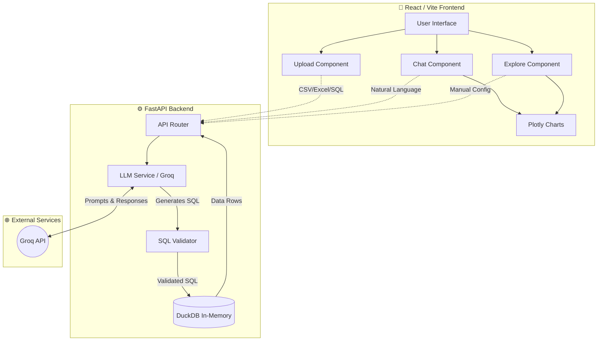

  

# 🏗️ System Architecture

This document describes the high-level architecture of the **AI Data Analyst** application.

## 🌐 Overview

The application follows a standard client-server architecture:

- **Frontend**: A React application built with Vite and Tailwind CSS.
- **Backend**: A FastAPI application in Python, utilizing DuckDB for in-memory analytical processing.
- **AI Integration**: Powered by Groq's Llama 3.3 70B for natural language understanding and SQL generation.

---

## 📊 Architecture Diagram

---

## 🚀 Data Flow: Chatting with Data

1. **User asks a question** in the frontend chat panel.
2. **Backend receives the request** and passes the question + table schema to the `llm_service`.
3. **Groq validates relevance**: An initial fast LLM call checks if the question is "On-Topic" or "Off-Topic".
4. **SQL Generation**: The LLM generates a read-only DuckDB SQL query.
5. **SQL Validation**: The backend parses the query string to guarantee no mutating operations (`DROP`, `DELETE`, etc.) exist.
6. **Execution**: The query runs against the temporary in-memory `DuckDB` instance assigned to that dataset.
7. **Explanation & Charting**: The backend sends the query results back to the LLM for a plain-English explanation, and selects an appropriate chart type.
8. **Frontend Rendering**: The user sees the AI's explanation, a data table, the raw SQL, and a Plotly chart!

 

  <i>Designed for scalability, security, and lightning-fast AI interactions! 🏗️🧠</i>

